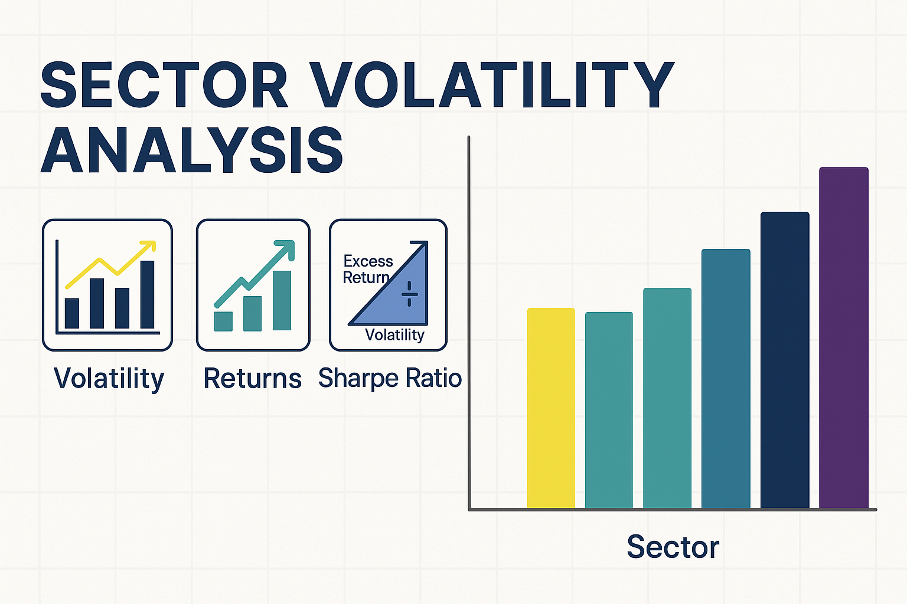

# Sector Volatility Analysis  
*Author: Emmanuel Ocran*  

This project analyzes seven years of historical stock data (June 2018 – May 2025) to evaluate sector-level volatility, returns, and risk-adjusted performance. Using key financial metrics like daily returns, rolling volatility, and Sharpe Ratios, the analysis highlights how major sectors perform under different market conditions.

## Objectives  
- Clean and unify daily stock price data across sectors  
- Engineer features: daily returns, rolling volatility, Sharpe Ratio  
- Compare sector risk and performance over time  
- Identify the most resilient sectors during downturns  
- Provide insights to support informed investment decisions  

## Sectors Analyzed  
| Sector                | Tickers                   |
|-----------------------|---------------------------|
| Technology            | AAPL, MSFT, NVDA, AMD     |
| Energy                | XOM, CVX, COP, HAL        |
| Healthcare            | JNJ, PFE, UNH, MRK        |
| Financials            | JPM, BAC, WFC, GS         |
| Consumer Discretionary| AMZN, TSLA, HD, MCD       |
| Utilities             | NEE, DUK, SO, AEP         |

## Tools & Technologies  
- Python (Pandas, NumPy, Seaborn, Matplotlib)  
- Jupyter Notebook  
- yfinance (data source)   

## Key Insights  
- Technology sector delivered the highest risk-adjusted return (Sharpe Ratio)  
- Energy sector exhibited the highest volatility with the lowest efficiency  
- Sector returns showed moderate positive correlations, limiting diversification  
- Technology and Consumer Discretionary recovered fastest post-COVID-19 downturn  

## How to Use  
1. Clone the repo and install required libraries  
2. Run the Jupyter notebook to reproduce the analysis  
3. Explore the saved figures or review the report
