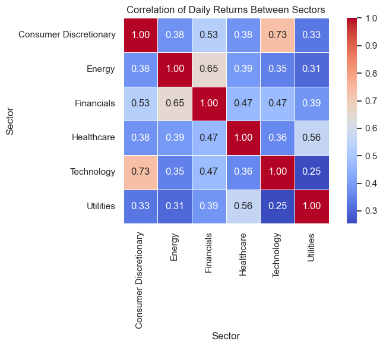
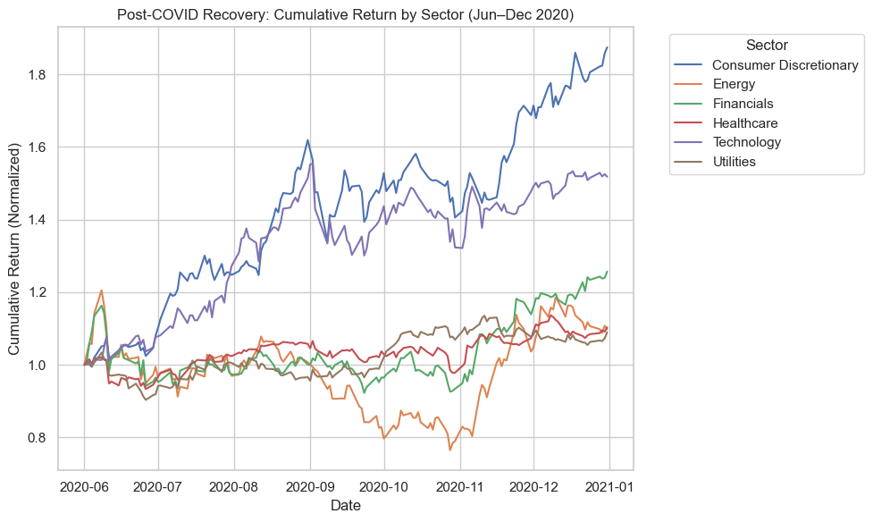

# Sector Volatility Analysis  
*Author: Emmanuel Ocran*  
*Date: July 2025*  

## 1. Executive Summary

- This project analyzed seven years of daily stock price data (2018–2025) across six major market sectors.
- It calculated and compared key financial metrics including daily returns, 30-day rolling volatility, and Sharpe ratios.
- The **Technology** sector demonstrated the strongest risk-adjusted performance, while **Energy** exhibited the highest volatility.
- Correlation analysis showed that most sectors are moderately correlated, with Technology and Utilities offering potential diversification benefits.
- The analysis identifies sectors that rebounded fastest after the COVID-19 crash, providing guidance for long-term portfolio allocation.

## 2. Problem Statement

Investors often struggle to identify which sectors offer stable, high-performing investment opportunities—especially during volatile periods like economic recessions or global crises. This project provides a structured analysis of sector-level price trends, volatility, and risk-adjusted returns to support data-driven portfolio decisions.

## 3. Objectives

- Load, clean, and structure historical stock data from 2018 to 2025  
- Calculate daily returns, 30-day rolling volatility, and Sharpe ratios per stock  
- Aggregate metrics by sector to understand broader trends  
- Visualize price patterns, volatility, and performance  
- Investigate return correlations and post-downturn recovery  
- Derive actionable insights for investment and diversification  

## 4. Data Overview

- **Source**: Daily stock prices collected using the `yfinance` API  
- **Time Period**: June 1, 2018 – June 1, 2025  
- **Frequency**: Daily  
- **Features**: `Date`, `Ticker`, `Sector`, `Close`  

### Sectors and Stocks Analyzed

| Sector               | Tickers               |
|----------------------|------------------------|
| Technology           | AAPL, MSFT, NVDA, AMD  |
| Energy               | XOM, CVX, COP, HAL     |
| Healthcare           | JNJ, PFE, UNH, MRK     |
| Financials           | JPM, BAC, WFC, GS      |
| Consumer Discretionary | AMZN, TSLA, HD, MCD |
| Utilities            | NEE, DUK, SO, AEP      |

## 5. Methodology

### Tools & Technologies:
- Python, Pandas, NumPy, Matplotlib, Seaborn
- `yfinance` API for stock data retrieval
- Jupyter Notebook for analysis

### Feature Engineering:
- **Daily Return**: Percent change in closing price
- **Rolling Volatility**: 30-day standard deviation of returns
- **Sharpe Ratio**: Mean return divided by standard deviation (risk-free rate = 0)

### Data Processing:
- All sector-level CSV files were loaded, cleaned, and merged into a single dataset.
- Duplicates and missing values were checked and addressed.
- Data types were validated to ensure analytical accuracy.

## 6. Key Analysis & Visualizations

### Price Trends  
Sector-level average prices were plotted over time, revealing macro trends such as:
- COVID-19 crash in early 2020
- Post-COVID recovery across all sectors
- Persistent growth in the Technology and Utilities sectors

### Volatility Analysis  
- Energy showed the **highest volatility**, indicating higher risk.
- Utilities and Technology were the **least volatile**, suggesting more stable behavior.

### Daily Returns  
- Average daily returns were computed and compared by sector.
- Consumer Discretionary and Technology consistently yielded higher daily gains.

### Sharpe Ratio  
- Calculated per stock and averaged by sector.
- **Technology** led with the highest risk-adjusted returns.
- **Energy** and **Healthcare** had the lowest Sharpe Ratios.

### Return Correlation Between Sectors  
- A correlation matrix revealed moderate positive correlations among sectors.
- Utilities showed relatively low correlation with others, indicating diversification potential.

### Recovery Analysis  
- Sectors were evaluated for rebound strength after the COVID-19 downturn (June–Dec 2020).
- Technology and Consumer Discretionary recovered the fastest, surpassing pre-crisis levels by year-end.

## 7. Key Insights

- **Technology** offers the best trade-off between return and risk over the long term.
- **Energy** is highly volatile and underperformed on a risk-adjusted basis.
- **Utilities** provide consistent returns with low volatility—ideal for conservative portfolios.
- Return correlations suggest diversification can be improved by balancing Utilities, Technology, and Financials.
- Rapid sector recovery after downturns may signal long-term resilience and investor confidence.

## 8. Recommendations

- For risk-averse investors: overweight **Utilities** and **Technology** for stable growth.
- For aggressive portfolios: cautiously include **Consumer Discretionary** and **Financials**, which offer higher returns but moderate volatility.
- Reduce exposure to **Energy** unless seeking high-risk, high-volatility plays.
- Leverage sector correlations when constructing diversified portfolios to minimize systemic risk.

## 9. Limitations

- The analysis assumes a **risk-free rate of 0**, which simplifies Sharpe calculations but doesn't reflect real-world treasury rates.
- Sector classification was done manually and may differ from institutional standards.
- No macroeconomic indicators (inflation, interest rates) were integrated.
- Assumes static sector membership; stocks may shift sectors over time.

## 10. Next Steps

- Build an interactive dashboard in **Power BI** or **Plotly Dash** for stakeholder presentations.
- Integrate external macroeconomic data (e.g., interest rates, inflation) for deeper insights.
- Extend the analysis with **machine learning models** for sector prediction and forecasting.
- Track quarterly performance to build a live portfolio allocation tool.

## 11. Appendices

- **Appendix A:** Full Sector Return Correlation Heatmap  
- **Appendix B:** Sector Recovery Performance Post-COVID  

### Appendix A: Sector Return Correlation Heatmap

This matrix displays pairwise correlation of average daily returns between sectors over the 7-year period.

---

### Appendix B: Sector Recovery After COVID-19

This chart compares cumulative returns by sector from June to December 2020 following the pandemic crash.

